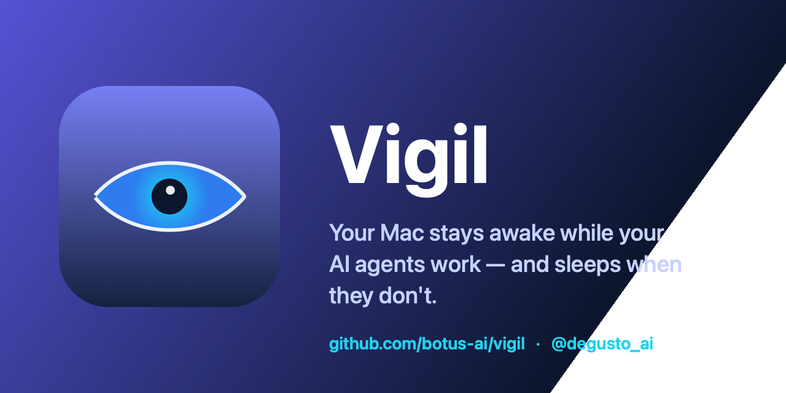

<div align="center">



# Vigil

**Your Mac stays awake while your AI agents work — and sleeps when they don't.**

[](https://github.com/botus-ai/vigil/actions/workflows/build.yml)
[](LICENSE)


[](https://github.com/botus-ai/vigil/stargazers)
[](https://github.com/botus-ai/vigil/releases/latest)

### [⬇️ Download Vigil.dmg](https://github.com/botus-ai/vigil/releases/latest) — free, 2-minute install

</div>

Vigil is a tiny macOS menu-bar app for developers who run AI agents. Unlike
Amphetamine or Caffeine, **there's no switch to flip.** Vigil detects active
**Claude Code, Claude Desktop, Codex, Cursor, aider, Ollama** and other agent sessions
and keeps your Mac awake *only while they're actually working* — even with the
**lid closed**. The moment your agents finish, your Mac sleeps and saves battery.

Close the lid and walk away. Your agent keeps running. When it's done, the Mac sleeps.

> Ever started a long agent task, closed the laptop, and come back to find it slept and
> killed your run? Or left Amphetamine on all night by accident? Vigil fixes both.

## Why Vigil

Running long agent tasks means babysitting Amphetamine: turn it on before you start,
remember to turn it off after. Forget, and your Mac never sleeps. Vigil removes the toggle
entirely — it's automatic, and it's accurate.

| | Vigil | Amphetamine / Caffeine | KeepingYouAwake |
|---|:---:|:---:|:---:|
| Keeps Mac awake | ✅ | ✅ | ✅ |
| **Automatic — no manual toggle** | ✅ | ⚠️ app-trigger only | ❌ |
| **Knows when an AI agent is *working*** | ✅ | ❌ | ❌ |
| Reads Claude transcript state (semantic) | ✅ | ❌ | ❌ |
| Sleeps automatically when agents stop | ✅ | ❌ | ❌ |
| **Lid-closed mode (battery, no display)** | ✅ | ✅ (manual) | ❌ |
| Stops redundant `caffeinate` for you | ✅ | ❌ | ❌ |
| Fully local, no telemetry | ✅ | ✅ | ✅ |
| Price | Free / Pro | Free | Free |

## Features

- 🧠 **Automatic agent detection.** Watches for Claude Code, the Claude VS Code extension,
  Claude Desktop, and (opt-in) Cursor, Codex, Gemini CLI, aider, Copilot CLI, Ollama.
- 🎯 **Semantic detection for Claude.** Reads `~/.claude/projects` to know when a session
  is *mid-turn* vs finished — precise even during quiet pauses between tool calls.
- 💤 **Sleeps when idle.** Releases the moment your agents stop, after a short grace period.
- 🔒 **Lid-closed mode.** Keep agents running with the laptop shut (battery, no external
  display) — backed by a crash-safe helper that always restores normal sleep.
- 🧹 **Cleans up after itself.** Finds and stops redundant `caffeinate` / DIY keep-awake
  scripts so Vigil is the single source of truth.
- 👀 **Honest status.** The menu shows whether an agent is working right now, with live throughput and CPU as proof.
- 🪶 **Tiny & private.** Menu-bar only, no Dock icon, no accounts, no network calls.

## Install (2 minutes)

1. Download the latest `Vigil.dmg` from **[Releases](https://github.com/botus-ai/vigil/releases/latest)**.
2. Drag **Vigil** into **Applications**.
3. First launch: **right-click the app → Open → Open** (builds aren't notarized yet, macOS warns once).
4. That's it — the eye appears in your menu bar, already in Automatic mode. On first run
   Vigil offers the optional lid-closed mode (one admin prompt installs a fail-safe helper).

Requires macOS 13+ and the Xcode Command Line Tools' `python3` for Claude Code hooks
(every Claude Code user already has it).

**Build from source** — needs the Swift toolchain (Xcode or Command Line Tools), no Xcode
project required:

```bash
git clone https://github.com/botus-ai/vigil.git
cd vigil
./scripts/build.sh
open build/Vigil.app
```

_Homebrew cask: coming soon._

## Usage

Click the menu-bar eye icon:

- **Automatic** — keep awake only while an AI agent is working (the default).
- **Keep Awake** / **Off** — classic manual modes.
- **Watch for…** — pick which AI tools to track (Claude, Codex, Gemini, aider, Cursor, Copilot, Ollama).
- **Precise detection (Claude Code hooks)** — ground truth from Claude itself (default on).
- **Semantic detection** — read Claude transcripts (fallback for sessions without hooks).
- **Keep awake with lid closed** — one-time admin approval installs the helper.
- **Stop other keep-awake tools** — quit redundant `caffeinate` / scripts.
- **Launch at Login** — on by default.

Icons: `eye` = idle · `eye.fill` = keeping awake · `bolt.fill` = force-awake · `moon.zzz` = off.

## How it works

Detection is layered, most reliable first:

1. **Ground truth — Claude Code hooks.** Vigil installs a tiny hook (merged into
   `~/.claude/settings.json`, one-time backup kept, removable from the menu), so Claude
   itself reports state the instant it changes: prompt submitted / tool running → working;
   permission prompt or waiting for input → a human is needed (sleep allowed); turn done →
   idle. No guessing, no polling lag. Crash-safe: a "working" marker only counts while its
   claude process is actually alive.
2. **Semantic state (fallback)** — for sessions without hooks, the transcript shows whether
   it's mid-turn (`stop_reason != end_turn`).
3. **Network/CPU heuristic (Claude Desktop, Codex, any GUI/CLI tool)** — sustained traffic
   *including loopback* (local ollama counts) or subtree CPU. GUI apps get special handling:
   an idle Electron window burns ~10% CPU just compositing (not "work"), so only sustained
   streaming bursts count — and a burst opens a ~5-minute working window that bridges the
   quiet thinking/tool gaps between streams. CPU of real tool children (bash/python spawned
   by the agent) still counts.

To avoid false positives, `claude`-named background tooling (vault sync, memory daemons,
Vigil's own helper) is excluded, and the heuristic is debounced so a single CPU blip can't
pin the Mac awake.

While any agent works, Vigil holds IOKit power assertions for **both** system and display
sleep (so the screen doesn't lock on you mid-task), plus a grace period after work stops.
For **lid-closed**, power assertions don't help — macOS sleeps on lid-close regardless — so
Vigil uses the documented `pmset disablesleep` flag via a small privileged helper. The app
writes a **heartbeat**; the helper disables lid-close sleep only while that heartbeat is
fresh, and **automatically restores normal sleep within ~30s** if Vigil ever stops. Your
Mac can't get stuck awake.

> **About the lock screen:** closing the lid *always* locks the screen — that's a macOS
> security feature no app can override. Your agent keeps running; you'll just see the lock
> screen when you reopen. With the lid **open**, Vigil keeps the display on so it won't lock
> while an agent is working.

## Privacy

Everything runs locally. Vigil reads process/network *counters* (via `ps`/`nettop`) and,
optionally, your local Claude transcript *state* — never their contents. It makes **no
network connections of its own**. No analytics, no accounts. See [PRIVACY.md](PRIVACY.md).

## Support this project ☕

Vigil is free and open source. If it saves your overnight runs, consider supporting it:

- [Buy Me a Coffee](https://www.buymeacoffee.com/degusto_ai)
- [Ko-fi](https://ko-fi.com/degusto_ai)
- ⭐ **Star the repo** — it genuinely helps others find it.

## Contributing

Issues and PRs welcome. Build with `./scripts/build.sh`; `Vigil --diagnose` prints a
one-shot detection snapshot for debugging.

## Author

Built by **[@degusto_ai](https://t.me/degusto_ai)**. Follow for more AI-dev tooling.

## License

[MIT](LICENSE) © 2026 botus-ai (@degusto_ai)
